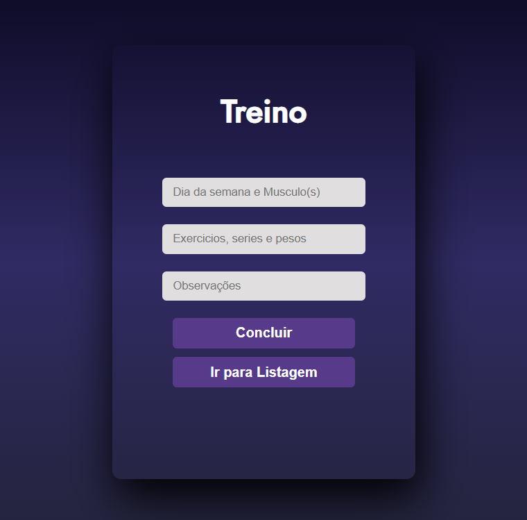

# 🖥️ Gym Note – Interface Front-end

Este repositório contém o **front-end** da aplicação `Gym Note`, responsável por enviar e exibir os dados de treinos da academia. Construído com HTML, CSS e JavaScript puro, se conecta à API em Spring Boot para realizar as operações de cadastro, edição, consulta e exclusão dos treinos.


## 🚀 Tecnologias utilizadas

- HTML5
- CSS3
- JavaScript (ES6)
- API REST via `fetch()`


## 📋 Funcionalidades

- Formulário para cadastro de treinos
- Listagem dos treinos cadastrados
- Edição de treinos existentes
- Exclusão com confirmação
- Integração total com a [API Back-end](https://github.com/Gustavo7K/GymNoteAPI)


## 📸 Prévia da Interface

- Tela de cadastro de treinos:
<p align="center">
  
</p>

- Tela de listagem de treinos:
<p align="center">
  
</p>


## 📦 Como rodar o front-end localmente

1. Clone este repositório:
   ```bash
   git clone https://github.com/Gustavo7K/GymNoteInterface.git
2. Abra o arquivo index.html diretamente no navegador ou use uma extensão de servidor local como:

- Live Server (VSCode)

- http-server (npm install -g http-server)

3. Certifique-se de que a API esteja rodando em http://localhost:8080 (ou outro endereço configurado no seu JavaScript)

## 🤝 Repositório complementar (Back-end)
Esta aplicação se comunica com a API desenvolvida em Spring Boot.
- ➡️ [Acesse aqui o repositório do back-end](https://github.com/Gustavo7K/GymNoteAPI)